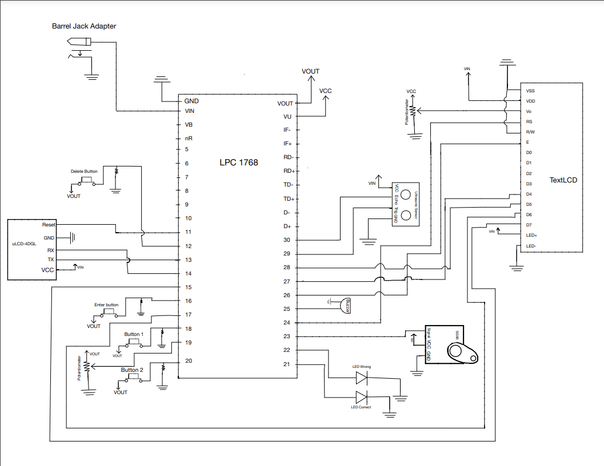

# SnZ Home Security System

The **SnZ Home Security System** is a two-factor authentication-based embedded system designed to secure a home using both button input and analog verification. The system features real-time status updates, an automatic door mechanism, and a live people counter — all coordinated through the Mbed LPC1768 microcontroller.

---

## 🛠️ What It Does

- **Two-Factor Authentication** using buttons and a potentiometer
- **Alarm System** activates after three failed attempts:
  - Displays “Intruder!!” on the uLCD
  - Sounds a buzzer
  - Flashes red LEDs
- **Automatic Door Opening**:
  - Triggered after correct authentication
  - Opens via a Servo SG90 for 10 seconds
- **Occupancy Counter**:
  - Uses an ultrasonic sensor to detect exit events
  - Displays live count on a TextLCD screen

---

## 🔧 Components & Their Purpose

| Component          | Role in System |
|--------------------|----------------|
| `uLCD-4DGL`         | Displays passcode input, system status, and intruder warnings |
| `Servo SG90`        | Physically opens/closes the door |
| `HC-SR04 Sensor`    | Detects people exiting the home |
| `TextLCD`           | Shows the current people count |
| `Mbed LPC1768`      | Central controller for all system logic |
| `4x Pushbuttons`    | Input passcode (1, 2), delete, and enter |
| `2x Potentiometers` | Used for analog input (part of 2FA) |
| `Buzzer`            | Alerts on intruder detection |
| `Red & Yellow LEDs` | Show passcode status (fail/success) |
| `Barrel Jack Adapter` | Supplies 5V to power high-current components |

- **VIN (5V)** powers: uLCD, TextLCD, Servo, Sensor  
- **VOUT (3.3V)** powers: buttons, potentiometers, LEDs, and buzzer

---

## ⚠️ Challenges Faced

Power management and input signal stability were major issues:

- **Floating Inputs**: Initially caused the uLCD to display numbers without button presses.
- **Button Issues**: Inputs sometimes failed due to weak or missing pull-down resistors.
- **Voltage Drops**: Shared power between components like the servo and sensors caused erratic behavior.
- **Breadboard Fragility**: Loose connections added complexity in debugging.

These were mitigated by adding proper pull-down resistors, isolating high-draw components to VIN, and verifying stable ground connections.

---

## 🔍 Comparison to Real-World Systems

| Feature                  | SnZ System | Traditional Systems |
|--------------------------|------------|---------------------|
| Passcode Input           | ✅          | ✅                  |
| Two-Factor Authentication| ✅          | ❌                  |
| Auto Door Mechanism      | ✅          | ❌                  |
| Occupancy Counter        | ✅          | ❌                  |
| Visual + Audio Feedback  | ✅          | ✅                  |

---

## 🚀 Future Improvements

If given more time and resources, we would:

- Replace the potentiometer with a **card reader** or **fingerprint scanner**
- Design a **3D-printed enclosure** for a more professional look
- Move from breadboard to a **custom PCB**
- Add **remote access** via Wi-Fi/Bluetooth (for mobile alerts and controls)

---

## 📸 Schematic

